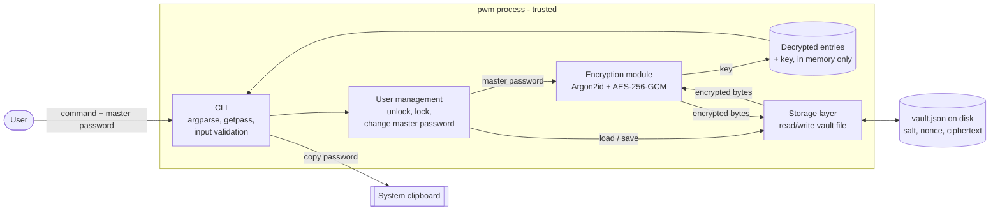

# Design document

Password manager, ICS0022 Secure Programming, Checkpoint 1.

## 1. Architecture

The program has four parts:

- **CLI**: parses commands, reads the master password with `getpass` (not echoed) and prints results.
  All user input goes through here and gets validated before it reaches the other modules.
- **User management**: handles unlocking the vault, changing the master password and locking
  the vault again when the command finishes. It never stores the master password. A password is
  correct when the vault decrypts successfully.
- **Encryption module**: derives the key from the master password with Argon2id, and encrypts or
  decrypts the vault with AES-256-GCM. This is the only module that uses the crypto libraries.
- **Storage layer**: reads and writes the vault file. It does not know anything about the
  contents; it only handles bytes, file permissions and safe writing.

### Data flow

Unlocking (for example `pwm get github`):
1. The CLI asks for the master password at a hidden prompt.
2. User management asks the storage layer for the vault file.
3. The storage layer reads `vault.json` and returns it.
4. The encryption module takes the salt and the KDF settings from the file, derives the key with
   Argon2id and decrypts the ciphertext with AES-GCM.
5. If decryption fails, the password is wrong or the file was changed. The user gets the same
   error message in both cases.
6. If it works, the entries are kept in memory, the command runs, and the result is printed.

Saving (after `add`, `update`, `delete`):
1. The entries are turned into JSON and encrypted with the same key and a new random nonce.
2. The storage layer writes the result to a temporary file in the same folder with permissions
   0600, and then replaces the old vault with it. A crash in the middle cannot leave a
   half-written vault.

### Where data lives

| Data | Where | Protected by |
|---|---|---|
| Vault (all entries) | `~/.pwmanager/vault.json` | AES-256-GCM, file mode 0600 |
| Salt, nonce, KDF settings | inside `vault.json`, not encrypted | not secret, but covered by the GCM tag so changes are detected |
| Encryption key | process memory only | never written to disk, removed when the command ends |
| Master password | process memory only, only during unlock | never stored anywhere |
| Decrypted entries | process memory only | removed when the command ends |
| Copied password | system clipboard | cleared after 20 seconds |

### Trust boundaries

1. **User / terminal to CLI.** Everything typed in is untrusted: command names, entry names,
   lengths. The CLI validates it before passing it on.
2. **Disk to storage layer.** The vault file can be read, copied, changed, or replaced (for
   example by a symlink) by someone else. It is not trusted until the GCM tag has been verified.
3. **Clipboard.** Other programs can read it, so a password only stays there for a short time.

Everything inside the `pwm` process is treated as trusted. Attacks on the machine itself, like
malware running as the same user or a keylogger, are out of scope. There is more on this in the
threat model.
